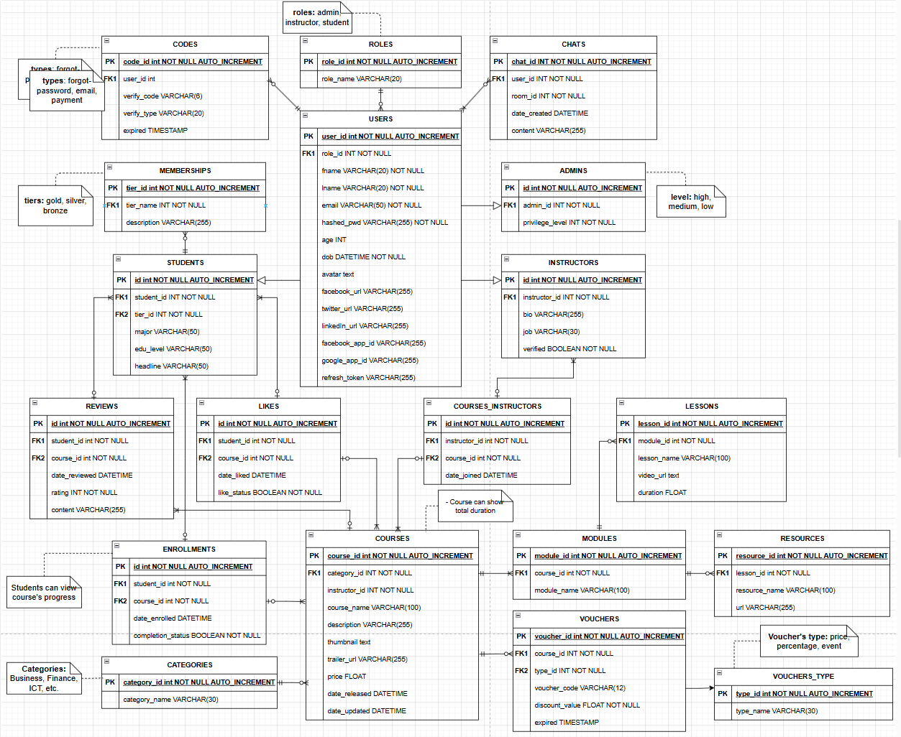

<p align="center">
  <a href="http://nestjs.com/" target="blank"></a>
</p>

[circleci-image]: https://img.shields.io/circleci/build/github/nestjs/nest/master?token=abc123def456
[circleci-url]: https://circleci.com/gh/nestjs/nest

  <p align="center">A progressive <a href="http://nodejs.org" target="_blank">Node.js</a> framework for building efficient and scalable server-side applications.</p>
    <p align="center">
<a href="https://www.npmjs.com/~nestjscore" target="_blank"></a>
<a href="https://www.npmjs.com/~nestjscore" target="_blank"></a>
<a href="https://www.npmjs.com/~nestjscore" target="_blank"></a>
<a href="https://circleci.com/gh/nestjs/nest" target="_blank"></a>
<a href="https://coveralls.io/github/nestjs/nest?branch=master" target="_blank"></a>
<a href="https://discord.gg/G7Qnnhy" target="_blank"></a>
<a href="https://opencollective.com/nest#backer" target="_blank"></a>
<a href="https://opencollective.com/nest#sponsor" target="_blank"></a>
  <a href="https://paypal.me/kamilmysliwiec" target="_blank"></a>
    <a href="https://opencollective.com/nest#sponsor"  target="_blank"></a>
  <a href="https://twitter.com/nestframework" target="_blank"></a>
</p>
  <!--[](https://opencollective.com/nest#backer)
  [](https://opencollective.com/nest#sponsor)-->

## Description

This project aims to develop a comprehensive e-learning platform tailored to connect students and educators in an interactive online environment. The application facilitates robust learning experiences by allowing educators to create and manage courses, upload diverse learning materials, and directly engage with students. Students can enroll in courses, actively participate through comments, rate course content, and utilize secure purchasing options for course enrollment.

## Relational Schema



## Project setup

Install node_modules
```bash
$ yarn install
```

Setup Postgres Database

```bash
# setup Postgres Database with Docker (and your own Database Management Tool, for example: TablePlus)
$ docker run --name some-postgres -e POSTGRES_PASSWORD=123456 -p 5432:5432 -d postgres
```

## Compile and run the project

```bash
# development
$ yarn run start

# watch mode
$ yarn run start:dev

# production mode
$ yarn run start:prod
```

## Run tests

```bash
# unit tests
$ yarn run test

# e2e tests
$ yarn run test:e2e

# test coverage
$ yarn run test:cov
```

## Deployment

When you're ready to deploy your NestJS application to production, there are some key steps you can take to ensure it runs as efficiently as possible. Check out the [deployment documentation](https://docs.nestjs.com/deployment) for more information.

If you are looking for a cloud-based platform to deploy your NestJS application, check out [Mau](https://mau.nestjs.com), our official platform for deploying NestJS applications on AWS. Mau makes deployment straightforward and fast, requiring just a few simple steps:

```bash
$ yarn install -g mau
$ mau deploy
```

With Mau, you can deploy your application in just a few clicks, allowing you to focus on building features rather than managing infrastructure.

## Resources

Check out a few resources that may come in handy when working with NestJS:

- Visit the [NestJS Documentation](https://docs.nestjs.com) to learn more about the framework.
- For questions and support, please visit our [Discord channel](https://discord.gg/G7Qnnhy).
- To dive deeper and get more hands-on experience, check out our official video [courses](https://courses.nestjs.com/).
- Deploy your application to AWS with the help of [NestJS Mau](https://mau.nestjs.com) in just a few clicks.
- Visualize your application graph and interact with the NestJS application in real-time using [NestJS Devtools](https://devtools.nestjs.com).
- Need help with your project (part-time to full-time)? Check out our official [enterprise support](https://enterprise.nestjs.com).
- To stay in the loop and get updates, follow us on [X](https://x.com/nestframework) and [LinkedIn](https://linkedin.com/company/nestjs).
- Looking for a job, or have a job to offer? Check out our official [Jobs board](https://jobs.nestjs.com).

## Support

Nest is an MIT-licensed open source project. It can grow thanks to the sponsors and support by the amazing backers. If you'd like to join them, please [read more here](https://docs.nestjs.com/support).

## Development Journal

This section records my daily contribution entries to the project source code.

<table>
  <thead>
    <tr style="background-color: black; color: white;">
      <th>Day</th>
      <th>Record Date</th>
      <th>Actions</th>
      <th>Challenges</th>
      <th>Thoughts</th>
    </tr>
  </thead>
  <tbody>
    <tr>
      <td>01</td>
      <td>29/01/2025</td>
      <td>- Initialized the project repository with GitHub.<br>- Set up the main project structure.</td>
      <td>No critical challenge occured yet</td>
      <td>Excited about the project's potential and looking forward for the next development stage</td>
    </tr>
    <tr>
      <td>02</td>
      <td>30/01/2025</td>
      <td>Create ERD and Relational Schema diagrams</td>
      <td>No critical challenge occured yet</td>
      <td>Analysing the relationship between entities and also the features requirement is time-consuming but worth to consider</td>
    </tr>
    <tr>
      <td>01</td>
      <td>31/01/2025</td>
      <td>- Setup Postgres database with Docker<br>- Create and Insert queries for database</td>
      <td>No critical challenge occured yet</td>
      <td>Learn to adopt the class-inheritance concept from relational schema to Postgres Database</td>
    </tr>
  </tbody>
</table>

## Stay in touch

- Author - [Kamil Myśliwiec](https://twitter.com/kammysliwiec)
- Website - [https://nestjs.com](https://nestjs.com/)
- Twitter - [@nestframework](https://twitter.com/nestframework)

## License

Nest is [MIT licensed](https://github.com/nestjs/nest/blob/master/LICENSE).
